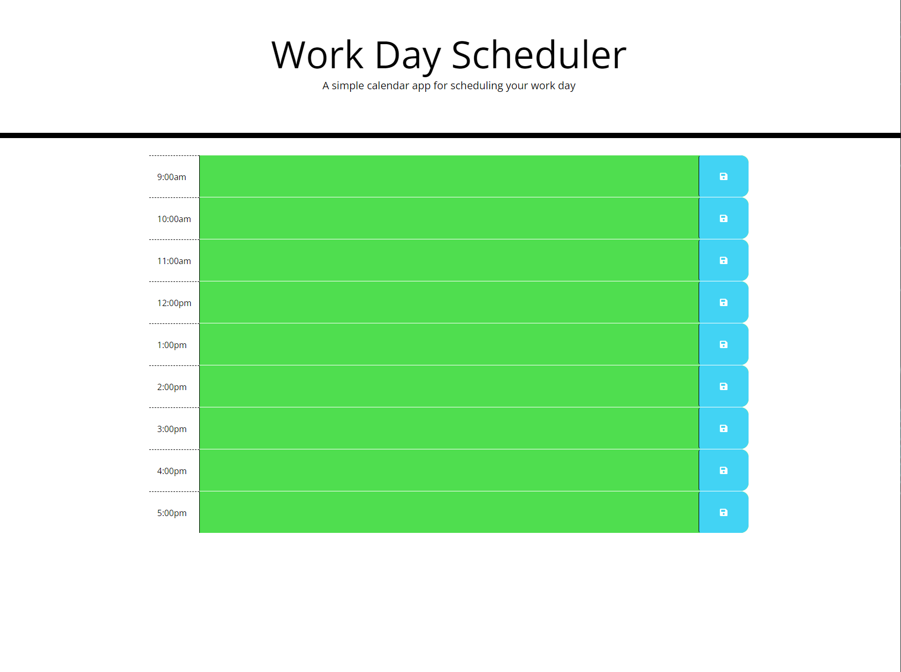

#05 Third Party APIs: Work Day Scheduler

## Description
The task is to create a calender application that we would be able to store and track any events with each hour of the day with modified starter code. This app will run and use programs such as HTML, CSS, as well as javascript powered by jquery.

## Links
- My GitHub repository: https://github.com/IanMosur06/challenge_5_Day_Planner
- Webpages live server: https://ianmosur06.github.io/challenge_5_Day_Planner/

## ScreenShot


## User Story

```md
AS AN employee with a busy schedule
I WANT to add important events to a daily planner
SO THAT I can manage my time effectively
```

## Acceptance Criteria

```md
GIVEN I am using a daily planner to create a schedule
WHEN I open the planner
THEN the current day is displayed at the top of the calendar
WHEN I scroll down
THEN I am presented with timeblocks for standard business hours
WHEN I view the timeblocks for that day
THEN each timeblock is color coded to indicate whether it is in the past, present, or future
WHEN I click into a timeblock
THEN I can enter an event
WHEN I click the save button for that timeblock
THEN the text for that event is saved in local storage
WHEN I refresh the page
THEN the saved events persist
```